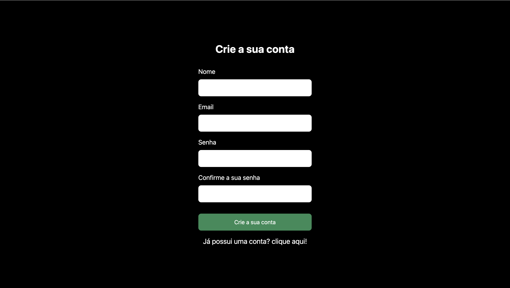
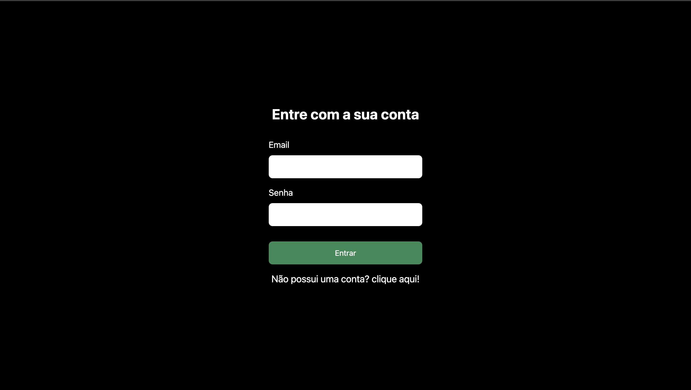

# 📸 Overview:





# 💻 Project:

## Neste projeto tive a idéia de desenvolver um sistema de autenticação para reutilizar em projetos futuros

## In this project I had the idea of developing an authentication system to reuse in future projects.

# 🚀 Technologies:

### ✔️ Fastify

### ✔️ NodeJS

### ✔️ Docker

### ✔️ Prisma

### ✔️ Typescript

### ✔️ Axios

### ✔️ React hook Form

### ✔️ Zod

### ✔️ NextJS

### ✔️ TailwindCSS

# How to run

```
# Clone this repository
$ git clone https://github.com/vinnycosta9898/ayth-system-jwt

# Go to the directory
$ cd auth-system-jwt

# Install Dependencies
$ npm install
$ yarn dev
$ pnpm install

# Run Web Server
$ npm run dev
$ yarn dev
$ pnpm run dev
```
